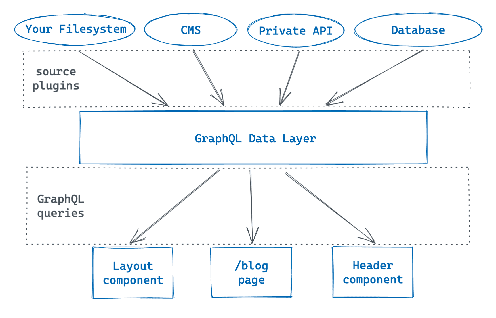

# Gatsby.js

> Gatsby is **an open-source framework that combines functionality from React, GraphQL and Webpack into a single tool for building static websites and apps**.

Static Site Generation is very common, [Next.js](../framework/Nextjs/intro.md) and [Nuxt.js](../framework/Nuxtjs/Intro.md) both supports Static Site Generation.
To me, Gatsby is like a wrapper of Next.js. Next.js give users the freedom to do whatever they like (get data from anywhere). Many syntax and features of Gatsby seem to be similar to next.js. Gatsby does not give that much freedom (not really, you can still do anything), instead, it did most of the stuff for you. With plugins, all data will be served through GraphQL.

## What's special about Gatsby?
In my opinion, there are 2 special features about Gatsby

- Large number of [plugins](https://www.gatsbyjs.com/plugins)
- GraphQL
	- The plugins can do whatever they want, whether reading files from disk or request data from external API, and serve the data through GraphQL.
	- We can obtain everything through GraphQl which is quite cool.
- **Based on React:** Unlike typical Jamstack frameworks like hugo and jekyll who uses template engine, Gatsby uses React. I personally prefer react especially when writting complicated stuff.




## Sample Usage
### gatsby-source-filesystem
[gatsby-source-filesystem](https://www.gatsbyjs.com/plugins/gatsby-source-filesystem/?=source)
```jsx
const data = useStaticQuery(graphql`
  query {
    allFile {
      nodes {
        name
        relativePath
      }
    }
  }
`);
```

Output
```json
{
  "data": {
    "allFile": {
      "nodes": [
        {
          "name": "icon",
          "relativePath": "icon.png"
        },
        {
          "name": "DataGenerationConversion",
          "relativePath": "LearnSQL/Notes/DataGenerationConversion.md"
        }
      ]
    }
  }
}
```

### gatsby-plugin-mdx
[gatsby-plugin-mdx](https://www.gatsbyjs.com/plugins/gatsby-plugin-mdx/) parses `md` or `mdx`  files and return their information such as
- tableOfContents
- slug
- wordCount
- frontmatter
- html
and much more.

The plugin can use other plugsin from [`rehypePlugins`](https://www.gatsbyjs.com/plugins/gatsby-plugin-mdx/#rehype-plugins) and [`remarkPlugins`](https://www.gatsbyjs.com/plugins/gatsby-plugin-mdx/#remark-plugins).


# Gatsby Plugin
[Docs](https://www.gatsbyjs.com/docs/creating-plugins/)

-   [Creating a Generic Plugin](https://www.gatsbyjs.com/docs/creating-a-generic-plugin/)
-   [Creating a Local Plugin](https://www.gatsbyjs.com/docs/creating-a-local-plugin/)
-   [Creating a Source Plugin](https://www.gatsbyjs.com/docs/creating-a-source-plugin/)
-   [Creating a Transformer Plugin](https://www.gatsbyjs.com/docs/creating-a-transformer-plugin/)


# Reference
- [Tutorial](https://github.com/gatsbyjs/tutorial-example)
- [Docs: Creating Plugins](https://www.gatsbyjs.com/docs/creating-plugins/)


